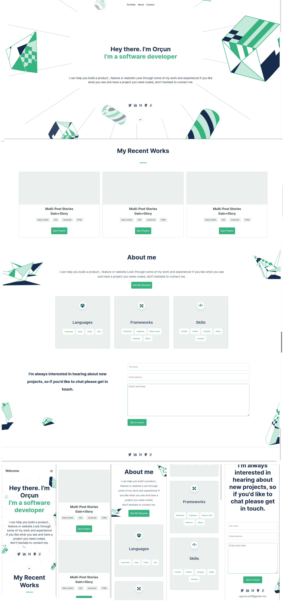

# My Portfolio

> Project that build in the first module of the Microverse. Build with HTML CSS and JavaScript.

In this project, forms and semantic HTML5 tags used while positioning for CSS made by using Flexboxes and Grid. Media queries have been used for responsive design. DOM used for mobile menu.

## Built With

- HTML & CSS
- JavaScript
- Media Queries
- GitHub Workflows, Figma, Browser Developer Tools.

## Live Demo

[Live Demo Link](https://luftedar.github.io/My-Portfolio/)

## Getting Started

To get a local copy up and running follow these simple example steps.

Clone the project by:

git clone https://github.com/luftedar/My-Portoflio.git

cd into the project folder by:

cd My-Portoflio

Open folder with code editor

### Prerequisites

- Web Browser.
- Code Editor.

## Authors

👤 **Orçun Uğur**

- GitHub: [@githubhandle](https://github.com/luftedar)
- Twitter: [@twitterhandle](https://twitter.com/OrcunUgur2)
- LinkedIn: [LinkedIn](https://www.linkedin.com/in/or%C3%A7un-u%C4%9Fur-089148181/)

## 🤝 Contributing

Contributions, issues, and feature requests are welcome!

Feel free to check the [issues page](../../issues/).

## Show your support

Give a ⭐️ if you like this project!

## Acknowledgments

- Hat tip to anyone whose code was used
- Inspiration
- etc

## 📝 License

This project is [MIT](./MIT.md) licensed.
